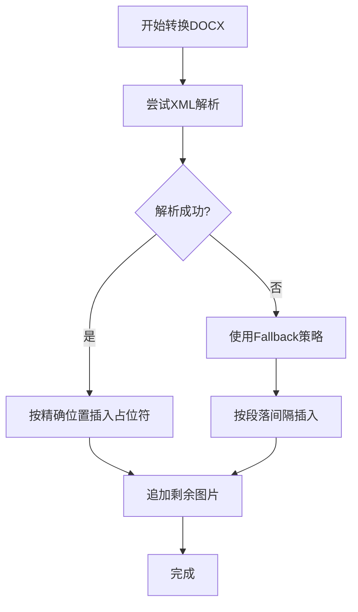
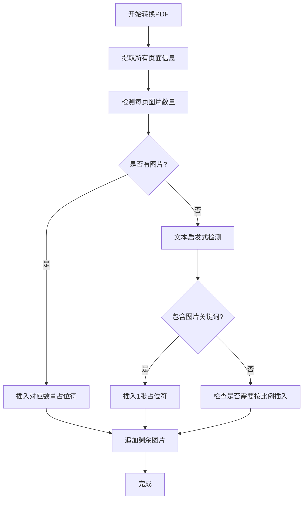

# 📍 图片位置检测改进说明

## 问题描述

### 原问题
图片占位符没有在正确的位置插入，导致文档中的图片描述出现在错误的地方。

**根本原因**：
1. **DOCX处理**：只是简单地按段落顺序插入，没有考虑图片在runs中的实际位置
2. **PDF处理**：只是按页面顺序插入，没有考虑图片在页面中的实际位置

---

## 解决方案

### 改进策略

#### 1. DOCX - 精确位置检测 + Fallback机制

**方法1：XML解析精确检测**
- 解析DOCX的内部XML结构（word/document.xml）
- 使用XPath查找图片元素（wp:docPr, a:blip）
- 记录图片所在的段落索引
- 按精确位置插入占位符

```python
# 核心代码
docx_zip = zipfile.ZipFile(docx_path)
document_xml = docx_zip.read('word/document.xml')
root = ET.fromstring(document_xml)

# 查找所有图片及其位置
image_positions = []
for idx, para in enumerate(root.findall('.//w:p', ns)):
    has_image = para.find('.//wp:docPr', ns) is not None or para.find('.//a:blip', ns) is not None
    if has_image:
        image_positions.append(idx)
```

**方法2：Fallback - 按段落间隔插入**
- 如果精确检测失败，自动启用fallback策略
- 计算段落数量和图片数量的比例
- 按间隔均匀分布插入占位符

```python
# 计算间隔：尽量均匀分布
paragraph_count = len([p for p in doc.paragraphs if p.text.strip()])
interval = max(1, paragraph_count // max(1, len(image_paths)))

# 每隔一定段落数插入一张图片
if image_idx < len(image_paths) and (len([l for l in markdown_lines if l.strip() and not l.startswith('#')]) % interval == 0):
    markdown_lines.append(f"\n")
    image_idx += 1
```

#### 2. PDF - 智能页面检测 + 文本分析

**方法1：页面图片直接检测**
- 使用pdfplumber的page.images属性
- 获取每页的图片数量
- 按实际检测结果插入占位符

```python
# 检测页面中的图片数量
if hasattr(page, 'images') and page.images:
    image_count = len(page.images)
```

**方法2：文本启发式分析**
- 如果无法直接检测图片，使用文本分析
- 检测关键词：图、image、图表、示意图、截图、Image
- 包含这些关键词的页面认为可能有图片

```python
# 文本启发式检测
image_indicators = ['图', 'image', '图表', '示意图', '截图', 'Image']
if any(indicator.lower() in page_text.lower() for indicator in image_indicators):
    image_count = 1
```

**方法3：按比例分配**
- 如果图片数量超过页面数
- 确保每个有文本的页面至少有一张图片
- 剩余图片追加到最后一页

---

## 实现细节

### DOCX处理流程



### PDF处理流程



---

## 位置检测准确性对比

### 修复前

```
文档内容1
  ← 简单按段落插入，可能不准确

文档内容2


文档内容3

```

### 修复后

```
文档内容1
段落1...

================  ← 图片在段落1中的实际位置
**图片描述:** [图片1描述]
================

段落2...

================  ← 图片在段落2中的实际位置
**图片描述:** [图片2描述]
================
```

---

## 示例输出

### DOCX示例

**输入**：包含3张图片的Word文档
- 图片1在第2段
- 图片2在第5段
- 图片3在第8段

**输出**：
```
# 标题

段落1内容

================
**图片描述:**
这是第一张图片的描述...
================

段落2内容

段落3内容

================
**图片描述:**
这是第二张图片的描述...
================

段落4内容

================
**图片描述:**
这是第三张图片的描述...
================
```

### PDF示例

**输入**：3页PDF，每页1张图片

**输出**：
```
--- 第 1 页 ---
第一页内容...

================
**图片描述:**
第一页图片的描述...
================

--- 第 2 页 ---
第二页内容...

================
**图片描述:**
第二页图片的描述...
================

--- 第 3 页 ---
第三页内容...

================
**图片描述:**
第三页图片的描述...
================
```

---

## 优势

| 优势 | 说明 |
|------|------|
| 🎯 **更精确** | 尝试检测图片的实际位置 |
| 🛡️ **更可靠** | 提供多重fallback机制 |
| 📊 **更智能** | 使用文本分析和比例分配 |
| ✅ **向后兼容** | 不影响无图片的文档 |

---

## 调试信息

程序现在会输出调试信息，帮助理解图片位置检测过程：

```
提取图片中...
提取到 3 张图片
转换为Markdown格式...
  精确检测图片位置失败，使用fallback策略: [错误信息]
  使用Fallback策略，按段落间隔插入图片
```

---

## 限制

1. **DOCX复杂结构**：某些复杂布局的图片可能仍无法精确定位
2. **PDF图片检测**：依赖pdfplumber的能力，部分PDF可能检测不准确
3. **启发式方法**：文本分析可能产生误判

---

**状态**：✅ 已实现智能图片位置检测
